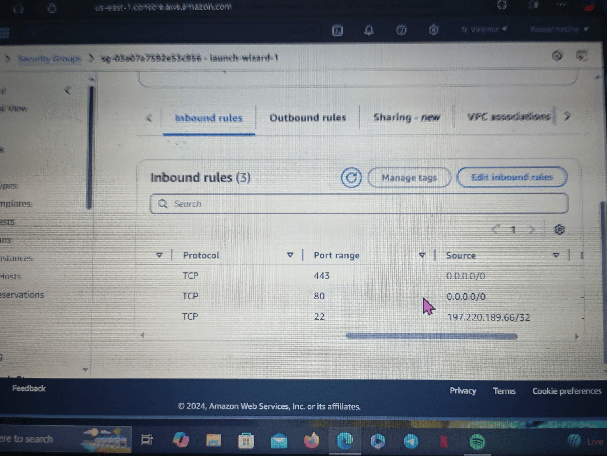
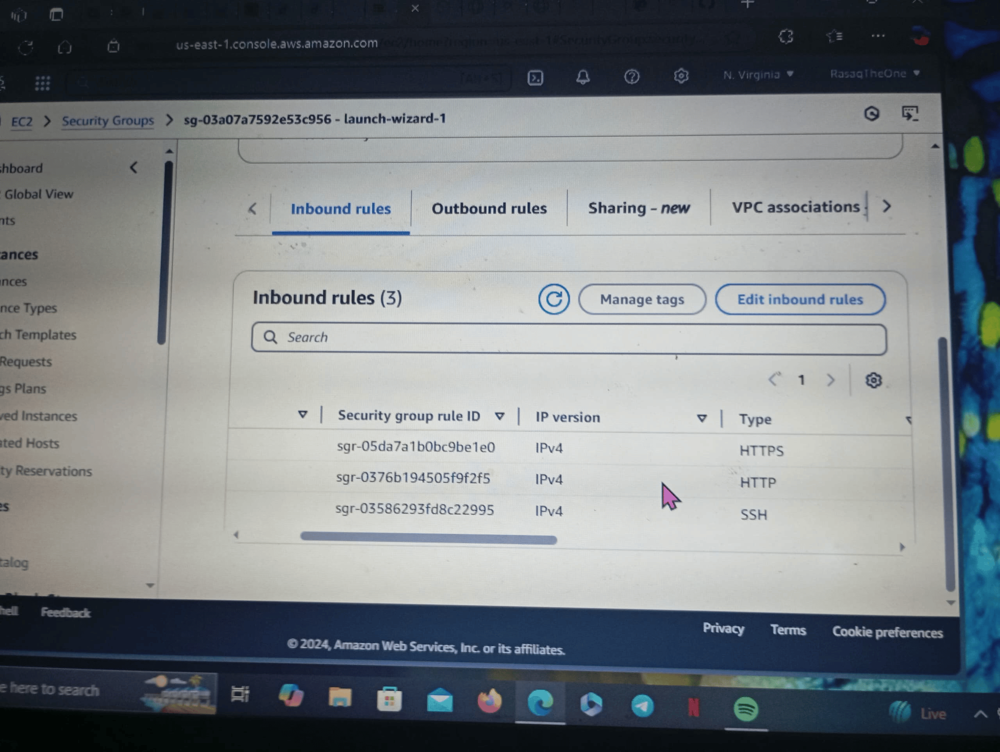
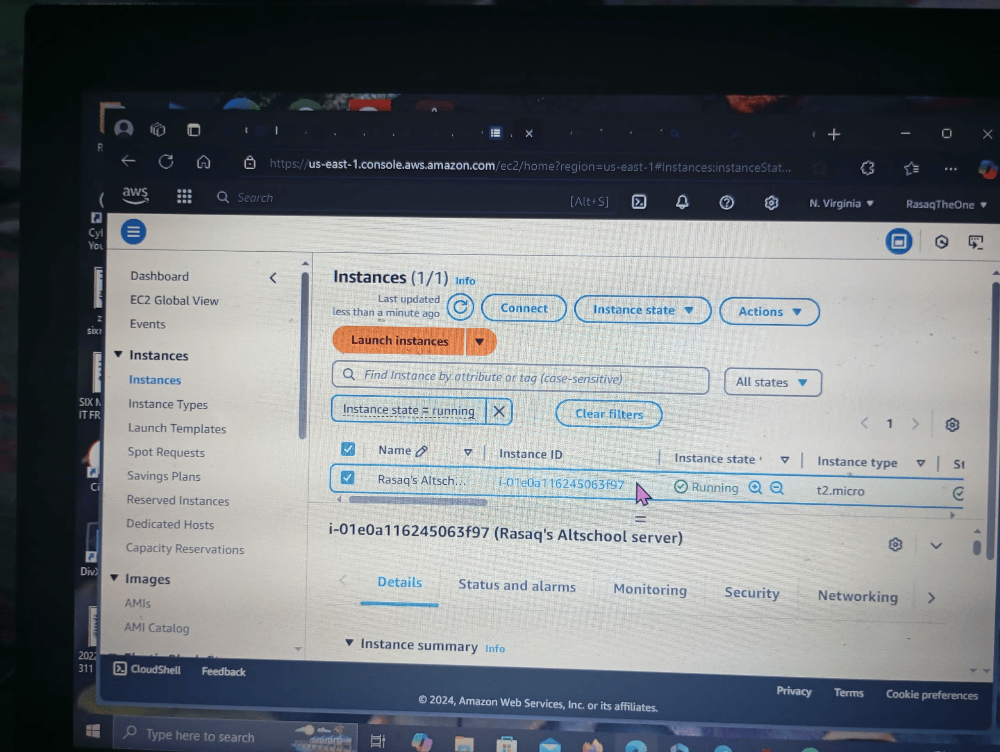
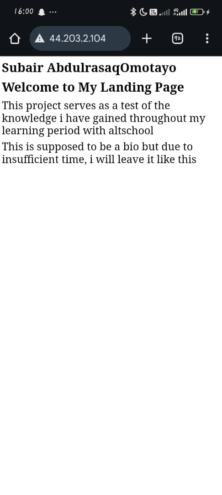
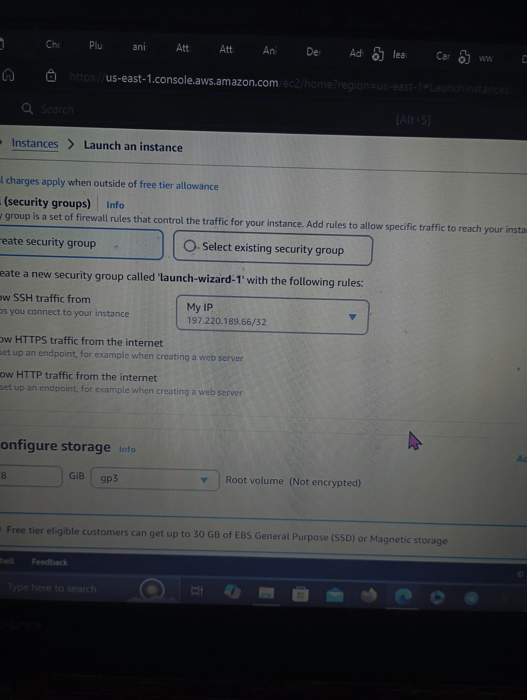

# Web Server Documentation

## Public IP Address
Your web server is hosted at: http://44.203.2.104

## Access Instructions
1. Open a web browser.
2. Enter the public IP address in the address bar.
3. The deployed index.html file should load successfully.

## Commands Used
- *Install Apache Web Server*:
  bash
  sudo apt update
  sudo apt install apache2
  
- *Start and Enable Apache*:
  bash
  sudo systemctl start apache2
  sudo systemctl enable apache2
  
- *Upload File*:
  bash
  scp -i "C:/RasaqAltKey.pem" C:/index.html ubuntu@44.203.2.104:/var/www/html/
  

## Troubleshooting
- Ensure the security group allows HTTP (port 80) access.
- Check Apache service status:
  bash
  sudo systemctl status apache2
  

## Additional Notes
- Keep the server running to allow access.
- Update the index.html file as needed using the scp command.